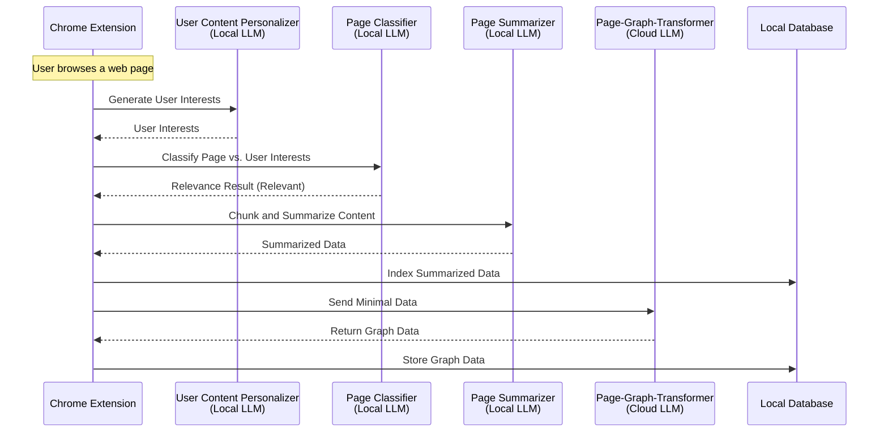

# BrowseGraph

   <video src="https://github.com/user-attachments/assets/aca8849b-0dce-4ff8-9dc1-9cc46b0055d0" width="400" control autoplay loop/>

## The 2nd Brain for Visual Thinkers

Everything you browse, fully connected and always accessible.
BrowseGraph is the first implementation of a local-first GraphRAG.

  

---

## 📌 Getting Started

1. **Install BrowseGraph**  
   Add BrowseGraph to your Chrome browser with a single click. No complicated setups.

2. **Start Browsing**  
   BrowseGraph works silently in the background, connecting every page you visit into a dynamic visual network.

3. **Search and Ask**  
   Access all your knowledge seamlessly. Instantly search, navigate, and discover information whenever you need it.

## 🌟 Features

- **Local-First Processing**: All AI computations are performed locally within your browser using in-browser LLMs.
- **Dynamic Knowledge Graphing**: Automatically capture and organize everything you browse into a visual knowledge network.
- **Smart Content Filtering**: Filters out irrelevant pages based on your interests.
- **Efficient Summarization**: Summarizes and indexes page content for quick access.
- **Graph-Based Insights**: Creates and stores graph data to enhance content recommendations.
- **Blazingly Fast Retrieval**: Retrieve any piece of your browsed content instantly with powerful search and intuitive navigation.

---

## 🧩 How It Works

## 🔒 Privacy & Security

- **Data Locality:** All raw data processing occurs within your browser using local LLMs and local vector DB.
- **Minimal Cloud Interaction:** Only non-sensitive, aggregated data is sent to the cloud for graph transformations.
- **No Data Sharing:** Your browsing data is never shared with third parties.

## 📈 Roadmap

- [ ] **Conversational Interface:** Build an interactive conversational layer to simplify user interactions.
- [ ] **Artifacts UX:** Enable a side-by-side view of chat and graph for seamless exploration.
- [ ] **Bring Your Own Key (BYOK):** Support user-provided keys for LLM providers to offer flexibility and control.
- [ ] **Chrome Web Store Launch:** Officially release BrowseGraph on the Chrome Web Store.
